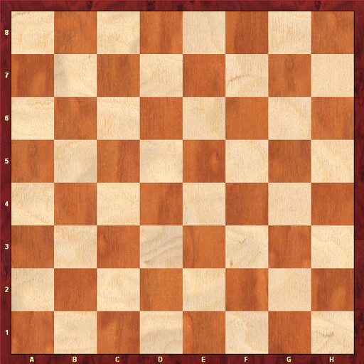
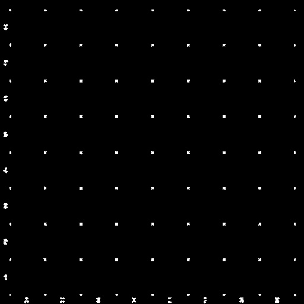
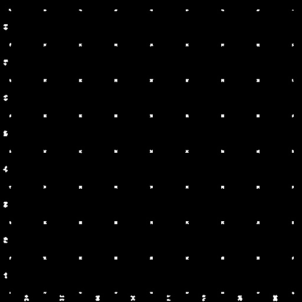

# HarrisCorner Detection Algorithm

## Prerequisites:
1)	Cmake (version tested on 3.10.1)  
2)	OpenCV(version tested on 4.1.2)  
3)	CUDA (version tested on 10.1)  
4)	C++ Compiler (tested on Visual Studio 2017 version and the native compiler that comes with it)  
5)	Tested platform: windows 10  

## Steps to run:
1)	Build the project files using Cmake. In windows, you need to open up Cmake, point the source to where the files and ‘CMakeLists.txt’ file is and set a directory for build files as well. Press ‘Configure’ multiple times till all red-lines are gone and then Generate.  
2)	Build the project  
3)	Run
Notes: User needs to provide a path to an image as an argument to the program. Multiple images have been tested. One of the best one for Harris corner is an image that has a lot of corners such as a chess board image.  

## Benchmark report:

The result of timing of the code is logged to the console. For my laptop here are the time lines: 
 
GPU processing: 14.87 millisecond  
For more information on how the GPU benchmark is captured: (https://devblogs.nvidia.com/how-implement-performance-metrics-cuda-cc/)  
CPU total time: 1.52 seconds  

## Notes:
Inside the “CudaKernels.cu” code, if you want to do further processing such as checking the output of each step of the algorithm, you can uncomment the “testDebug” function calls.  

## Sample output results
### Original Image

### Harris Corner with CPU

### Harris Corner with GPU
